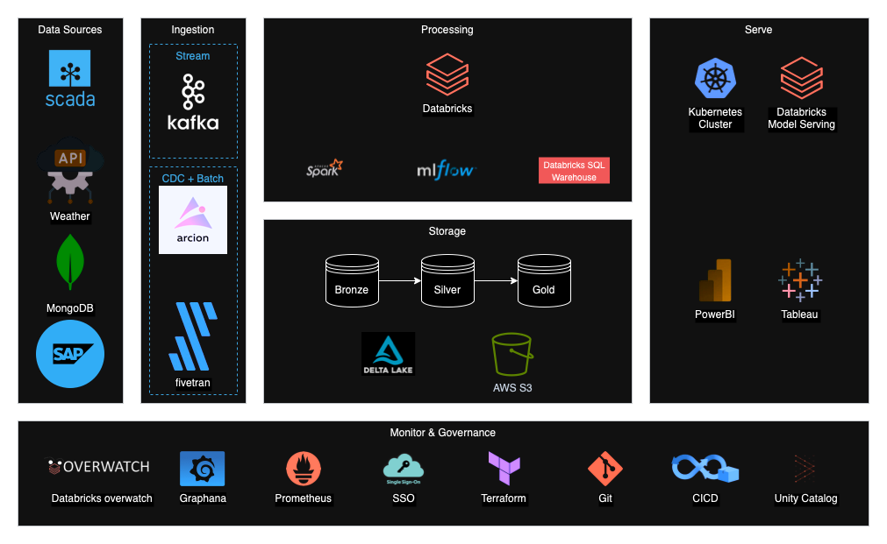

# High-level data solution architecture

## Overview

The proposed data architecture solution aims to address the business requirements of the water utilities company by integrating various data sources, including address data, water and waste pressure/flow data, and predictive rainfall data, to provide insights into the state of water and waste flow, potential pipe blockages, and historical blockage patterns.

## Data Sources & Integration

- The address data is stored in two disparate systems: SAP and a legacy MongoDB database. To integrate these datasets, the solution will use a postal code and street name comparison approach to join the records.
- The water and waste pressure/flow data is stored in the SCADA system, which produces data every 15 minutes. The SCADA development team has built a streaming solution, and the data architecture will need to establish the necessary connections to ingest this data.
- The predictive and historical rainfall data will be obtained from a public RESTful API, which is updated daily. This data will be incorporated into the data platform to provide additional context and insights.

## Data Platform Architecture

  

The proposed data platform architecture will be cloud-based to ensure scalability, flexibility, and cost efficiency.

The fundamental design principles of the data platform is referenced from the **Medallion Architecture**. The Medallion Architecture is a reference architecture for building scalable and cost-effective data platforms in the cloud. It provides a blueprint for designing a modern data platform that can handle large volumes of data, support real-time and batch processing, and enable advanced analytics and machine learning capabilities.

### Key Components

#### Data Ingestion

- **Kafka**: A distributed event streaming platform that will be used to ingest data from various sources, including the SCADA system and the RESTful API.

- **Arcion**: Arcion is a replication tool that _Databricks_ acquired to help customers replicate data from various sources into Delta Lake. It will be used to ingest data from the SAP and MongoDB databases. This is a good alternative to Apache Kafka that will be available in the Databricks platform soon.

- **Fivetran**: A cloud-based data integration tool that can be used to ingest data from the SCADA system into the data platform.

#### Data Storage

- **Delta Lake**: An open-source storage layer that brings ACID transactions to Apache Spark and big data workloads. Delta Lake will be used as the primary data storage layer for the data platform.

- **Amazon S3**: A cloud-based object storage service that will be used to store raw data, intermediate data, and processed data.
  - **Bronze**: Raw data will be stored in the Bronze layer in its original format.
  - **Silver**: Intermediate data will be stored in the Silver layer after being cleaned and transformed.
  - **Gold**: Processed data will be stored in the Gold layer after being aggregated and enriched.

#### Data Processing

- **Apache Spark**: A unified analytics engine for big data processing, with built-in modules for SQL, streaming, machine learning, and graph processing. Apache Spark will be used to process the data stored in Delta Lake.

- **Databricks SQl Warehouse**: A cloud-based data warehouse that will be used to run SQL queries on the data stored in Delta Lake.

- **Databricks ML**: A machine learning library that will be used to build and deploy machine learning models on the data stored in Delta Lake.

- **Databricks**: A unified data analytics platform that will be used to run Apache Spark jobs and notebooks. Databricks provides a collaborative environment for data engineers, data scientists, and business analysts to work together on data projects.

#### Data Serving

- **Databricks Model Serving**: A model serving platform that will be used to deploy machine learning models as RESTful APIs. This will enable real-time scoring of the machine learning models.

- **Kubernetes**: An open-source container orchestration platform that can be an alternative to Databricks Model Serving. Kubernetes can be used to deploy machine learning models as microservices.

- **Power BI**: A business intelligence tool that will be used to visualize the data stored in Delta Lake. Power BI provides interactive dashboards and reports that can be shared with stakeholders.

- **Tableau**: An alternative to Power BI that can be used to visualize the data stored in Delta Lake.

#### Data Monitoring & Governance

- **Databricks Overwatch**: A monitoring and governance tool that will be used to monitor the data platform and ensure compliance with data governance policies. This also helps the business to undertand the FinOps of the platform.

- **Graphana**: An open-source monitoring and observability platform that can be an alternative to Databricks Overwatch. Graphana can be used to monitor the data platform and visualize metrics and logs.

- **Promehteus**: An open-source monitoring and alerting toolkit that can be used to monitor the data platform. Prometheus can be integrated with Graphana to provide a comprehensive monitoring solution.

- **Single Sign-On (SSO)**: A security feature that will be used to authenticate users and control access to the data platform. SSO will be integrated with Databricks and other tools to ensure secure access to the data.

  - **Azure Databricks SCIM**: A feature that will be used to automate user provisioning and deprovisioning in Databricks. This will help to manage user access to the data platform.

- **Terraform**: An open-source infrastructure as code tool that will be used to automate the deployment of the data platform. Terraform will be used to define the infrastructure components as code and provision them in the cloud. This will also help developers to deploy jobs and notebooks in the Databricks platform, and promote the code through the lifecycle.

- **Git**: A version control system that will be used to manage the code and configuration files of the data platform. Git will be integrated with Databricks and other tools to track changes and collaborate on the codebase.

  - **Git Provider**: A cloud-based Git provider that will be used to host the codebase of the data platform. The Git provider will be integrated with Databricks and other tools to manage the codebase. There are many Git providers available, such as GitHub, GitLab, and Bitbucket.

- **CICD Pipeline**: A continuous integration and continuous deployment pipeline that will be used to automate the testing and deployment of the data platform. The CICD pipeline will be integrated with Databricks and other tools to promote the code through the lifecycle.

- **Unity Catalog**: A metadata management tool that will be used to catalog the data assets of the data platform. Unity Catalog provides a centralized repository for storing metadata and enables data discovery and lineage.

## Data Model

### Lake Layer

The data model in the `silver` layer below represents the raw data that will be ingested from the various data sources, including the SCADA system, SAP, MongoDB, and the RESTful API.

Here the data is cleaned and structured in a way that can be used for further processing and analysis from the bronze layer. The data is stored in a format that is optimized for query performance and data processing.

> A nice tool to use is the Databricks Auto Loader, which can be used to automatically load data from cloud storage into Delta Lake. This will help to optimize the data loading process and improve the performance of the data platform.

> Assumptions: Flow measurements has a location (latitude and longitude) and a timestamp. There needs to be some sort of relationship between the flow measurements and the address data. The rainfall data has a city attribute that can be used to join with the address data.

The data science team will be responsible for creating the models that will predict the chance of blockages in the pipes in the near future. The data engineering team will be responsible for integrating the models into the data platform.

### Warehouse Layer

The data model in the `gold` layer below represents the fact and dimension tables that will be used to store the data related to the state of the flow of water and waste, blockages in the pipes, and historical blockages.

#### Fact Tables

- **fact_flow_measurements**: Contains the flow measurements data, including water pressure, waste pressure, flow timestamp, and foreign keys to the address and rainfall data.

- **fact_blockages**: Contains the blockage data, including blockage timestamp, blockage cause, and foreign keys to the address and rainfall data.

#### Dimension Tables

- **dim_address**: Contains the address data, including postal code, street name, and city.

- **dim_rainfall_data**: Contains the rainfall data, including rainfall amount, rainfall date, and prediction flag.

## Key Considerations

- **Scalability**: The data platform architecture should be scalable to handle large volumes of data and support real-time and batch processing.

- **Flexibility**: The data platform architecture should be flexible to accommodate changes in data sources, data formats, and data processing requirements.

- **Cost Efficiency**: The data platform architecture should be cost-effective to minimize the infrastructure and operational costs of the data platform.

- **Security**: The data platform architecture should be secure to protect the data assets of the water utilities company and ensure compliance with data governance policies.

- **Data Quality**: The data platform architecture should ensure the quality of the data by implementing data validation, data cleansing, and data enrichment processes.

- **Data Governance**: The data platform architecture should enforce data governance policies to ensure the privacy, security, and integrity of the data assets.

- **Data Lineage**: The data platform architecture should provide data lineage to track the origin and transformation of the data assets.

- **Data Discovery**: The data platform architecture should enable data discovery to facilitate the exploration and analysis of the data assets.

- **Performance**: The data platform architecture should be optimized for performance to provide fast and reliable access to the data assets.

## Limiting Factors

- **Legacy Systems**: The integration of data from legacy systems, such as SAP and MongoDB, may pose challenges due to the differences in data formats and data structures.

- **Data Silos**: The presence of data silos in the water utilities company may hinder the integration and analysis of data across different departments.

- **Data Quality**: The quality of the data from the SCADA system and the RESTful API may vary, which could impact the accuracy and reliability of the insights generated by the data platform.

- **Resource Constraints**: The water utilities company may have limited resources, such as budget, expertise, and infrastructure, which could limit the implementation and operation of the data platform.
